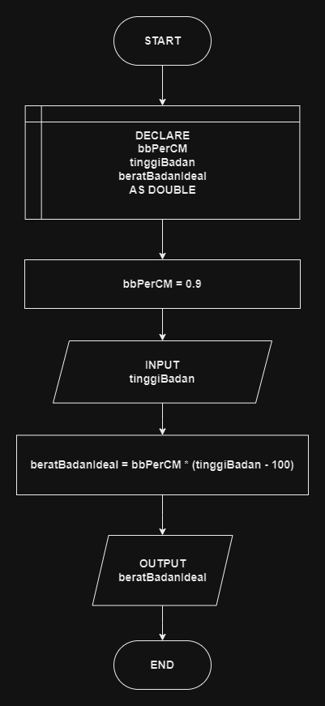

# 

## 🔰 Source Code

- [Berat Badan Ideal](bb_ideal.cpp)

## 🔰 Flowchart

<a href = "flow_bb_ideal.png"></a>

## 🔰 Pseudocode

```
BEGIN
    DECLARE BERAT_BADAN_IDEAL_PER_CM AS CONSTANT DOUBLE = 0.9
    DECLARE tinggiBadan, beratBadanIdeal AS DOUBLE

    OUTPUT "=== Program Menghitung Berat Badan Ideal ==="

    OUTPUT "Masukkan tinggi badan (dalam cm): "
    INPUT tinggiBadan

    SET beratBadanIdeal = hitungBeratBadanIdeal(tinggiBadan)

    OUTPUT "Berat badan ideal Anda adalah: " + beratBadanIdeal + " kg"
    OUTPUT "============================================"
END

FUNCTION hitungBeratBadanIdeal(tinggi AS DOUBLE) RETURNS DOUBLE
    DECLARE BERAT_BADAN_IDEAL_PER_CM AS CONSTANT DOUBLE = 0.9
    RETURN BERAT_BADAN_IDEAL_PER_CM * (tinggi - 100)
END FUNCTION
```

## 🔰 Algoritma

```
1. Mulai
2. Buat FUNGSI hitungBeratBadanIdeal(tinggi: BILANGAN) -> BILANGAN:
    - Deklarasikan variabel beratBadanIdeal sebagai bilangan desimal.
    - Hitung beratBadanIdeal dengan rumus beratBadanIdeal = BERAT_BADAN_IDEAL_PER_CM * (tinggi - 100).
    - Kembalikan nilai beratBadanIdeal.
3. END FUNGSI hitungBeratBadanIdeal.
4. Deklarasikan konstanta BERAT_BADAN_IDEAL_PER_CM sebagai bilangan desimal dan berikan nilai 0.9.
5. Deklarasikan variabel tinggiBadan, beratBadanIdeal sebagai bilangan desimal.
6. Tampilkan pesan "=== Program Menghitung Berat Badan Ideal ===".
7. Tampilkan pesan "Masukkan tinggi badan (dalam cm): ".
8. Baca nilai tinggiBadan dari pengguna.
9. Hitung beratBadanIdeal dengan memanggil fungsi hitungBeratBadanIdeal(tinggiBadan).
10. Tampilkan pesan "Berat badan ideal Anda adalah: " + beratBadanIdeal + " kg".
11. Tampilkan pesan "============================================".
12. Selesai.
```
