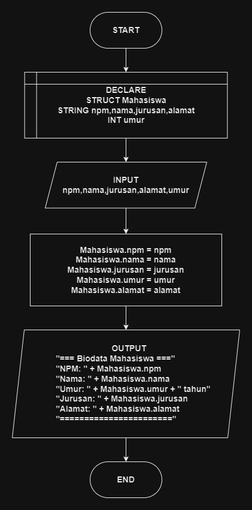

# 

## 🔰 Source Code

- [Biodata Mahasiswa](biodata_mhs.cpp)

## 🔰 Flowchart

<a href="flow_biodata_mhs.png"></a>

## 🔰 Pseudocode

```
BEGIN
    DECLARE mahasiswa AS Mahasiswa

    OUTPUT "+++ Input Biodata Mahasiswa +++"

    OUTPUT "NPM: "
    INPUT mahasiswa.npm

    OUTPUT "Nama: "
    INPUT mahasiswa.nama

    OUTPUT "Umur: "
    INPUT mahasiswa.umur

    OUTPUT "Jurusan: "
    INPUT mahasiswa.jurusan

    OUTPUT "Alamat: "
    INPUT mahasiswa.alamat

    OUTPUT "=== Biodata Mahasiswa ==="
    OUTPUT "NPM: " + mahasiswa.npm
    OUTPUT "Nama: " + mahasiswa.nama
    OUTPUT "Umur: " + mahasiswa.umur + " tahun"
    OUTPUT "Jurusan: " + mahasiswa.jurusan
    OUTPUT "Alamat: " + mahasiswa.alamat
    OUTPUT "========================="
END

```

## 🔰 Algoritma

```
1. Mulai program.
2. Deklarasikan struktur data Mahasiswa dengan atribut npm, nama, umur, jurusan, dan alamat.
3. Tampilkan "+++ Input Biodata Mahasiswa +++".
4. Input Mahasiswa.npm.
5. Input Mahasiswa.nama.
6. Input Mahasiswa.umur.
7. Input Mahasiswa.jurusan.
8. Input Mahasiswa.alamat.
9. Tampilkan "=== Biodata Mahasiswa ===".
10. Tampilkan nilai Mahasiswa.npm.
11. Tampilkan nilai Mahasiswa.nama.
12. Tampilkan nilai Mahasiswa.umur dengan menyertakan keterangan "tahun".
13. Tampilkan nilai Mahasiswa.jurusan.
14. Tampilkan nilai Mahasiswa.alamat.
15. Tampilkan "=========================".
16. Selesai.
```
