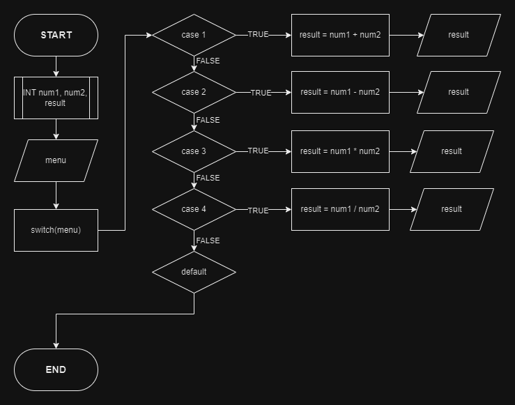

# 

## 🔰 Source Code

- [Kalkulator C++](kalkulator.cpp)

## 🔰 Flowchart



## 🔰 Algoritma

``` cpp
1. Mulai program kalkulator sederhana C++.
2. Tampilkan pesan "Selamat datang di program kalkulator sederhana C++ dengan menu".
3. Tetapkan variabel boolean "exit" dengan nilai "false".
4. Selama "exit" adalah "false", lakukan langkah berikut:
    a.Tampilkan pilihan operator yang tersedia:
        "1. Penjumlahan"
        "2. Pengurangan"
        "3. Perkalian"
        "4. Pembagian"
        "5. Modulus"
        "0. Keluar"
    b. Tampilkan pesan "Masukkan nomor pilihan Anda: ".
    c. Baca nomor pilihan dari pengguna dan simpan dalam variabel "op".
    d. Jika "op" sama dengan 0, maka:
        Set "exit" menjadi "true" dan keluar dari loop.
    e. Jika "op" bukan angka antara 1 hingga 5, tampilkan pesan "Pilihan tidak valid" dan lanjut ke langkah berikutnya.
    f. Baca angka pertama dari pengguna dan simpan dalam variabel "num1".
    g. Baca angka kedua dari pengguna dan simpan dalam variabel "num2".
    h. Gunakan struktur switch case untuk mengevaluasi pilihan operator "op":
        - Jika "op" adalah 1, hitung "num1 + num2" dan tampilkan hasilnya.
        - Jika "op" adalah 2, hitung "num1 - num2" dan tampilkan hasilnya.
        - Jika "op" adalah 3, hitung "num1 * num2" dan tampilkan hasilnya.
        - Jika "op" adalah 4, periksa apakah "num2" adalah 0. Jika ya, tampilkan pesan "Error: Tidak bisa membagi dengan nol" dan lanjut ke iterasi berikutnya. Jika tidak, hitung "num1 / num2" dan tampilkan hasilnya.
        - Jika "op" adalah 5, hitung "num1 % num2" dan tampilkan hasilnya.
    i. Lanjutkan ke iterasi berikutnya dalam loop.
4. Tampilkan pesan "Terima kasih...".
5. Selesai.
```

## 🔰 Pseudocode

```python

BEGIN
    DECLARE NUM1, NUM2 AS DOUBLE
    DECLARE OP AS INTEGER

    OUTPUT "SELAMAT DATANG DI PROGRAM KALKULATOR SEDERHANA C++ DENGAN MENU"

    DECLARE EXIT AS BOOLEAN AND SET TO FALSE
    WHILE EXIT IS FALSE:
        OUTPUT "PILIH OPERATOR YANG INGIN ANDA GUNAKAN:"
        OUTPUT "1. PENJUMLAHAN (+)"
        OUTPUT "2. PENGURANGAN (-)"
        OUTPUT "3. PERKALIAN (*)"
        OUTPUT "4. PEMBAGIAN (/)"
        OUTPUT "5. MODULUS (%)"
        OUTPUT "0. KELUAR"
        OUTPUT "MASUKKAN NOMOR PILIHAN ANDA: "
        BACA OP DARI PENGGUNA

        IF OP EQUALS 0:
            SET EXIT TO TRUE
            KELUAR DARI LOOP
        END IF

        IF OP IS NOT BETWEEN 1 AND 5:
            OUTPUT "ERROR: PILIHAN TIDAK VALID"
            LANJUTI ITERASI BERIKUTNYA DALAM LOOP
        END IF

        OUTPUT "MASUKKAN ANGKA PERTAMA: "
        BACA NUM1 DARI PENGGUNA
        OUTPUT "MASUKKAN ANGKA KEDUA: "
        BACA NUM2 DARI PENGGUNA

        DECLARE RESULT AS DOUBLE
        DECLARE TIPE AS STRING
        DECLARE INTNUM1, INTNUM2 AS INTEGER AND SET TO 0

        SWITCH OP:
            CASE 1:
                SET TIPE TO "+"
                SET RESULT TO NUM1 + NUM2
            CASE 2:
                SET TIPE TO "-"
                SET RESULT TO NUM1 - NUM2
            CASE 3:
                SET TIPE TO "*"
                SET RESULT TO NUM1 * NUM2
            CASE 4:
                IF NUM2 EQUALS 0:
                    OUTPUT "ERROR: TIDAK BISA MEMBAGI DENGAN NOL"
                    LANJUTI ITERASI BERIKUTNYA DALAM LOOP
                ELSE:
                    SET TIPE TO "/"
                    SET RESULT TO NUM1 / NUM2
                END IF
            CASE 5:
                SET TIPE TO "%"
                SET INTNUM1 TO NILAI INTEGER DARI NUM1
                SET INTNUM2 TO NILAI INTEGER DARI NUM2
                SET RESULT TO INTNUM1 % INTNUM2
        END SWITCH

        OUTPUT "HASIL OPERASI " + NUM1 + " " + TIPE + " " + NUM2 + " = " + RESULT

    OUTPUT "TERIMA KASIH..."
END

```
