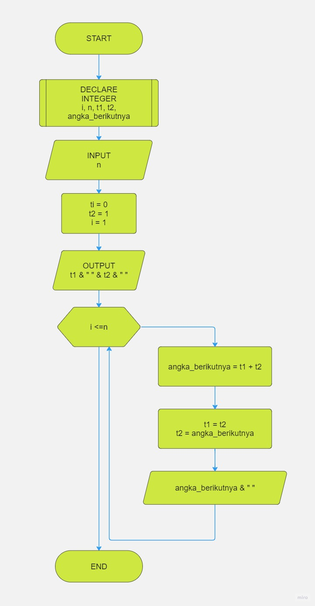

<a href="https://git.io/typing-svg"></a>

## 🔰 Pseudocode

```
DECLARE
INT n, t1, t2, angka_berikutnya

BEGIN
SET t1 = 0
SET t2 = 1
SET angka_berikutnya = 0

INPUT n

FOR i = 1 TO i <= n
    IF i = 1 THEN
        PRINT t1, " "
        CONTINUE
    END IF
    
    IF i = 2 THEN
        PRINT t2, " "
        CONTINUE
    END IF

    SET angka_berikutnya = t1 + t2
    SET  t1 = t2
    SET t2 = angka_berikutnya
        
    PRINT angka_berikutnya, " "
END FOR

PRINT ""
END

```

## 🔰 Algoritma

1. Mulai program
2. Inisialisasi variabel t1 dengan nilai 0 dan t2 dengan nilai 1
3. Minta input dari pengguna berupa nilai n, yaitu jumlah deret
4. Fibonacci yang diinginkan
5. Jika n lebih besar atau sama dengan 1, tampilkan nilai t1
6. Jika n lebih besar atau sama dengan 2, tampilkan nilai t2
7. Untuk setiap nilai i mulai dari 3 hingga i kurang dari atau sama dengan n lakukan langkah 7-10
8. Hitung nilai angka berikutnya dengan menambahkan nilai t1 dan t2
9. Atur nilai t1 sama dengan nilai t2
10. Atur nilai t2 sama dengan nilai angka berikutnya
11. Tampilkan nilai angka berikutnya
12. Selesai

## 🔰 Flowchart

<a href="flow_fibonacci.jpg"> </a>
