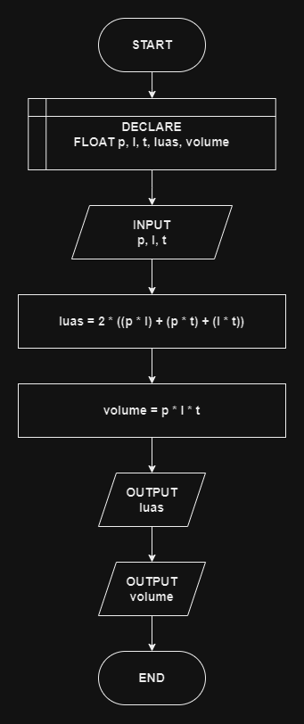

# 

## 🔰 Source Code

- [Luas Balok](../luas_keliling.cpp#L83)

## 🔰 Flowchart

<a href="flow_balok.png"></a>

## 🔰 Pseudocode

```
BEGIN
    DECLARE PANJANG, LEBAR, TINGGI, LUAS_PERMUKAAN, VOLUME AS FLOAT

    INPUT PANJANG
    INPUT LEBAR
    INPUT TINGGI

    SET LUAS_PERMUKAAN TO 2 * ((PANJANG * LEBAR) + (PANJANG * TINGGI) + (LEBAR * TINGGI))
    SET VOLUME TO PANJANG * LEBAR * TINGGI

    OUTPUT LUAS_PERMUKAAN
    OUTPUT VOLUME
END

```

## 🔰 Algoritma

```
1. Mulai program.
2. Deklarasikan variabel panjang, lebar, tinggi, luasPermukaan, dan volume sebagai float.
3. Input nilai panjang.
4. Input nilai lebar.
5. Input nilai tinggi
6. Hitung luasPermukaan dengan rumus luasPermukaan = 2 * ((panjang * lebar) + (panjang * tinggi) + (lebar * tinggi)).
7. Hitung volume dengan rumus volume = panjang * lebar * tinggi.
8. Tampilkan hasil luasPermukaan.
9. Tampilkan hasil volume.
10. Selesai.
```
