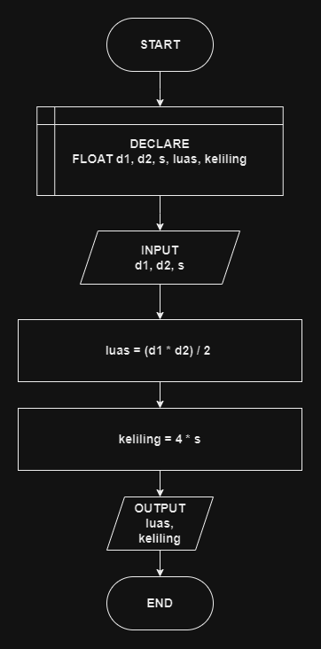

# 

## 🔰 Source Code

- [Luas & Keliling Belah Ketupat](../luas_keliling.cpp#L165)

## 🔰 Flowchart

<a href="flow_belah_ketupat.png"></a>

## 🔰 Pseudocode

```
BEGIN
    DECLARE DIAGONAL1, DIAGONAL2, SISI, LUAS, KELILING AS FLOAT

    INPUT DIAGONAL1
    INPUT DIAGONAL2
    INPUT SISI

    SET LUAS TO (DIAGONAL1 * DIAGONAL2) / 2
    SET KELILING TO 4 * SISI

    OUTPUT LUAS
    OUTPUT KELILING
END
```

## 🔰 Algoritma

```
1. Mulai program.
2. Deklarasikan variabel DIAGONAL1, DIAGONAL2, SISI, LUAS, KELILING sebagai float.
3. Input nilai DIAGONAL1.
4. Input nilai DIAGONAL2.
5. Input nilai SISI.
6. Hitung luas belah ketupat dengan rumus LUAS = (DIAGONAL1 * DIAGONAL2) / 2.
7. Hitung keliling belah ketupat dengan rumus KELILING = 4 * SISI.
8. Tampilkan LUAS.
9. Tampilkan KELILING.
10. Selesai.
```
