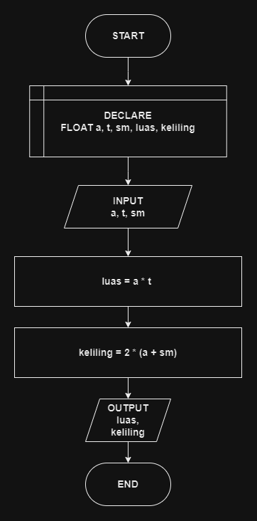

# 

## 🔰 Source Code

- [Luas & Keliling Jajar Genjang](../luas_keliling.cpp#L186)

## 🔰 Flowchart

<a href="flow_jajar_genjang.png"></a>

## 🔰 Pseudocode

```
BEGIN
    DECLARE ALAS, TINGGI, SISI_MIRING, LUAS, KELILING AS FLOAT
    INPUT ALAS
    INPUT TINGGI
    INPUT SISI_MIRING

    SET LUAS TO ALAS * TINGGI
    SET KELILING TO 2 * (ALAS + SISI_MIRING)

    OUTPUT LUAS
    OUTPUT KELILING
END

```

## 🔰 Algoritma

```
1. Mulai program.
2. Deklarasikan variabel ALAS, TINGGI, SISI_MIRING, LUAS, KELILING sebagai bilangan desimal.
3. Input nilai ALAS.
4. Input nilai TINGGI.
5. Input nilai SISI_MIRING.
6. Hitung luas segitiga dengan rumus LUAS = ALAS * TINGGI.
7. Hitung keliling segitiga dengan rumus KELILING = 2 * (ALAS + SISI_MIRING).
8. Tampilkan LUAS.
9. Tampilkan KELILING.
10. Selesai.

```
