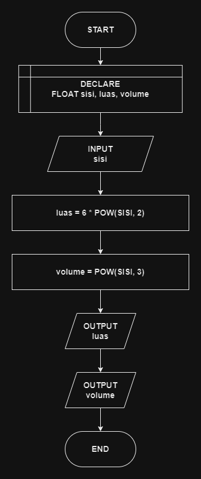

# 

## 🔰 Source Code

- [Luas & Volume Kubus](../luas_keliling.cpp#L104)

## 🔰 Flowchart

<a href="flow_kubus.png"></a>

## 🔰 Pseudocode

```
BEGIN
    DECLARE SISI, LUAS_PERMUKAAN, VOLUME AS FLOAT
    INPUT SISI
    SET LUAS_PERMUKAAN TO 6 * POW(SISI, 2)
    SET VOLUME TO POW(SISI, 3)
    OUTPUT LUAS_PERMUKAAN
    OUTPUT VOLUME
END

```

## 🔰 Algoritma

```
1. Mulai program.
2. Deklarasikan variabel SISI, LUAS_PERMUKAAN, dan VOLUME sebagai float.
3. Input nilai SISI.
4. Hitung luas permukaan dengan rumus LUAS_PERMUKAAN = 6 * POW(SISI, 2).
5. Hitung volume dengan rumus VOLUME = POW(SISI, 3).
6. Tampilkan hasil LUAS_PERMUKAAN.
7. Tampilkan hasil VOLUME.
8. Selesai.

```
