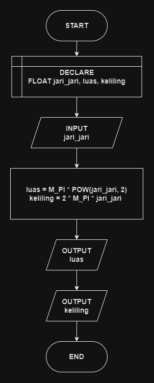

# 

## 🔰 Source Code

- [Luas & Keliling Lingkaran](../luas_keliling.cpp)
  
## 🔰 Flowchart



## 🔰Pseudocode

``` text
BEGIN
    DECLARE JARI_JARI, LUAS, KELILING AS FLOAT
    INPUT JARI_JARI
    SET LUAS TO M_PI * POW(JARI_JARI, 2)
    SET KELILING TO 2 * M_PI * JARI_JARI
    OUTPUT LUAS
    OUTPUT KELILING
END
```

## 🔰 Algoritma

```
1. Mulai program.
2. Deklarasikan variabel JARI_JARI, LUAS, dan KELILING sebagai bilangan desimal.
3. Baca nilai jari-jari dan simpan dalam variabel JARI_JARI.
4. Hitung luas lingkaran dengan rumus LUAS = π * JARI_JARI * JARI_JARI.
5. Hitung keliling lingkaran dengan rumus KELILING = 2 * π * JARI_JARI.
6. Tampilkan nilai variable LUAS
7. Tampilkan nilai variable KELILING
8. Selesai.
```
