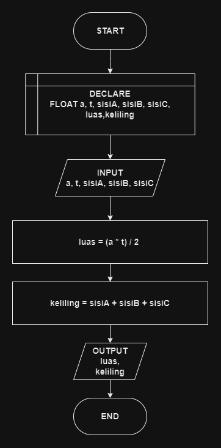

# 

## 🔰 Source Code

- [Luas & Keliling Segitiga](../luas_keliling.cpp#L140)

## 🔰 Flowchart

<a href="flow_segitiga.png"></a>

## 🔰 Pseudocode

```
BEGIN
    DECLARE ALAS, TINGGI, SISI_A, SISI_B, SISI_C, LUAS, KELILING AS FLOAT

    INPUT ALAS
    INPUT TINGGI
    
    INPUT SISI_A
    INPUT SISI_B
    INPUT SISI_C

    SET LUAS TO (ALAS * TINGGI) / 2
    SET KELILING TO SISI_A + SISI_B + SISI_C

    OUTPUT LUAS
    OUTPUT KELILING
END
```

## 🔰 Algoritma

```
1. Mulai program.
2. Deklarasikan variabel ALAS, TINGGI, SISI_A, SISI_B, SISI_C, LUAS, KELILING sebagai bilangan desimal.
4. Input nilai ALAS.
5. Input nilai TINGGI.
6. Input nilai SISI_A.
7. Input nilai SISI_B.
8. Input nilai SISI_C.
9. Hitung luas segitiga dengan rumus LUAS = (ALAS * TINGGI) / 2.
10. Hitung keliling segitiga dengan rumus KELILING = SISI_A + SISI_B + SISI_C.
11. Tampilkan LUAS.
12. Tampilkan KELILING.
13. Selesai.

```
