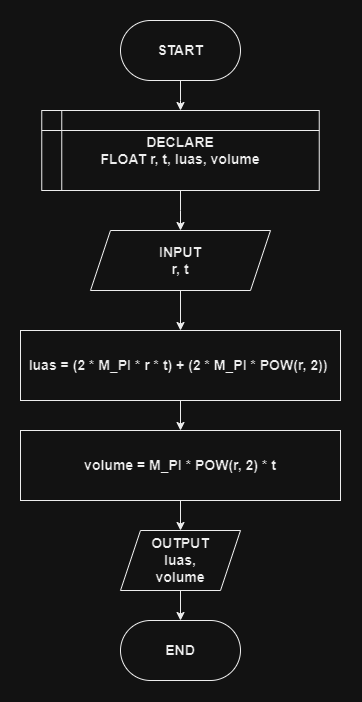

# 

## 🔰 Source Code

- [Luas & Volume Tabung](../luas_keliling.cpp#L121)

## 🔰 Flowchart



## 🔰 Pseudocode

```
START
    DECLARE JARI_JARI, TINGGI, LUAS_PERMUKAAN, VOLUME AS FLOAT
    INPUT JARI_JARI
    INPUT TINGGI

    SET LUAS_PERMUKAAN TO (2 * M_PI * JARI_JARI * TINGGI) + (2 * M_PI * POW(JARI_JARI, 2))
    SET VOLUME TO M_PI * POW(JARI_JARI, 2) * TINGGI

    OUTPUT LUAS_PERMUKAAN
    OUTPUT VOLUME
END

```

## 🔰 Algoritma

```
1. Mulai program.
2. Deklarasikan variabel jariJari, tinggi, luasPermukaan, dan volume sebagai float.
3. Input nilai jariJari.
4. Input nilai tinggi.
5. Hitung luasPermukaan dengan rumus luasPermukaan = (2 * M_PI * jariJari * tinggi) + (2 * M_PI * pow(jariJari, 2)).
6. Hitung volume dengan rumus volume = M_PI * pow(jariJari, 2) * tinggi.
7. Tampilkan hasil luasPermukaan.
8. Tampilkan hasil volume.
9. Selesai.
```
