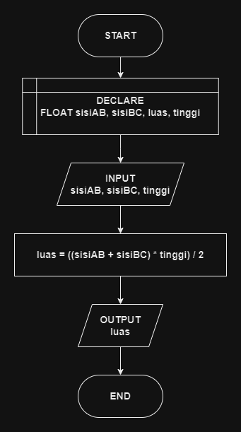

# 

## 🔰 Source Code

- [Luas Trapesium](../lkv/luas_keliling.cpp)

## 🔰 Flowchart



## 🔰 Pseudocode

```
START
    DECLARE SISI_AB, SISI_BC, LUAS AS FLOAT
    INPUT SISI_AB
    INPUT SISI_BC
    INPUT TINGGI

    SET LUAS TO ((SISI_AB + SISI_BC) * TINGGI) / 2

    OUTPUT LUAS
END
```

## Algoritma

```
1. Mulai program.
2. Deklarasikan variabel sisiAB, sisiBC, luas sebagai float.
3. Input nilai sisiAB.
4. Input nilai sisiBC.
5. Input nilai tinggi.
6. Hitung luas trapesium dengan rumus luas = ((sisiAB + sisiBC) * tinggi) / 2.
7. Tampilkan hasil luas.
8. Selesai.
```
